# AstroIngeniería — Museo Orbital

<p align="center">
  <a href="https://drayzu.github.io/AstroIngenieria/">
    
  </a>
</p>

---

## El museo

El recorrido está dividido en **9 salas temáticas** y reúne **106 conceptos**, avanzando progresivamente desde tecnologías orbitales relativamente cercanas hasta ingeniería planetaria, estelar y civilizaciones de escala cósmica.

Cada concepto incluye, según corresponda:

* mecanismo físico o principio de funcionamiento;
* escala y nivel de plausibilidad;
* métricas y órdenes de magnitud;
* riesgos y limitaciones;
* contexto narrativo y visual;
* fuentes y material técnico para profundizar.

Las salas de estudio combinan una lectura visual con dossiers técnicos y referencias externas de NASA, SETI y otras fuentes científicas o de ingeniería.

El museo no busca borrar la diferencia entre lo posible y lo fantástico. Parte de ella.

---

## Un cielo vivo

La exposición ocurre bajo un cielo interactivo que acompaña todo el recorrido.

Las estrellas reaccionan al cursor, aparecen constelaciones ambientales y puedes trazar las tuyas propias con **Mayús + clic**. Meteoros atraviesan ocasionalmente el cielo y una pequeña resortera permite lanzarlos manualmente: mantén pulsado, tensa y suelta.

La interfaz está pensada como parte de la experiencia, no únicamente como una forma de navegar entre fichas.

---

## Qué incluye

* 9 salas temáticas en un recorrido continuo.
* 106 conceptos de astroingeniería estructurados.
* Fichas con escala, plausibilidad, mecanismos, riesgos, métricas y fuentes.
* Lecturas extensas y dossiers técnicos.
* Navegación directa a salas y conceptos individuales.
* Vitrina para contrastar conceptos.
* Archivo de fuentes.
* Cielo estelar interactivo mediante Canvas.
* Constelaciones ambientales y dibujables.
* Sistema de meteoros e interacciones físicas.
* Galería de ilustraciones WebP para los distintos conceptos.

---

## Stack

* React 19
* TypeScript
* Vite
* Framer Motion
* Canvas 2D
* Sharp
* GitHub Pages

---

## Desarrollo local

```bash
npm install
npm run dev
```

Vite sirve la aplicación utilizando la base `/AstroIngenieria/`, consistente con su publicación en GitHub Pages.

### Verificación

```bash
npm run lint
npm run build
```

El proceso de build ejecuta TypeScript, genera el bundle de Vite y crea `dist/404.html` como fallback para las rutas internas utilizadas en GitHub Pages.

### Publicación

```bash
npm run deploy
```

El deploy publica `dist/` en GitHub Pages mediante `gh-pages`.

---

## Ilustraciones


